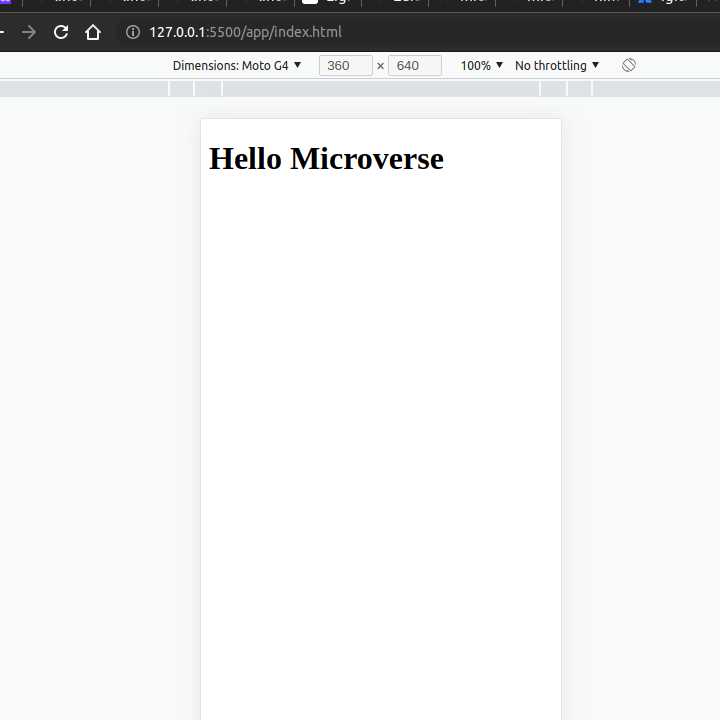

# Hello World

> A set-up project with github flow and linter configuration 

## Built With

- Html/css

👤 **Author**

- GitHub: [@himesh-suthar](https://github.com/himesh-suthar)
- LinkedIn: [@h7mesh](https://www.linkedin.com/in/h7mesh/)

## 🤝 Contributing

Contributions, issues, and feature requests are welcome!

Feel free to check the [issues page](../../issues/).

## Show your support

Give a ⭐️ if you like this project!

## Acknowledgments

- Thanks to team microverse for creating templates for readme.md

## 📝 License

This project is [MIT](./MIT.md) licensed.
